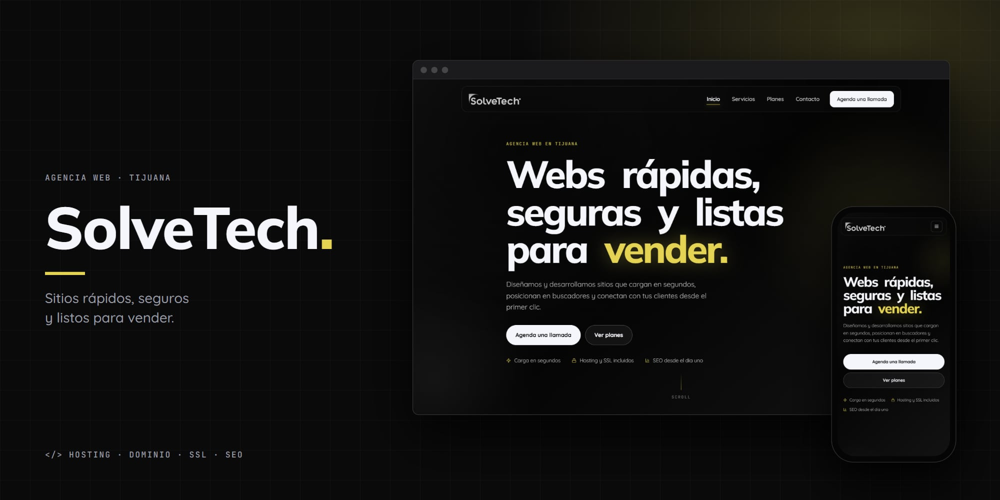
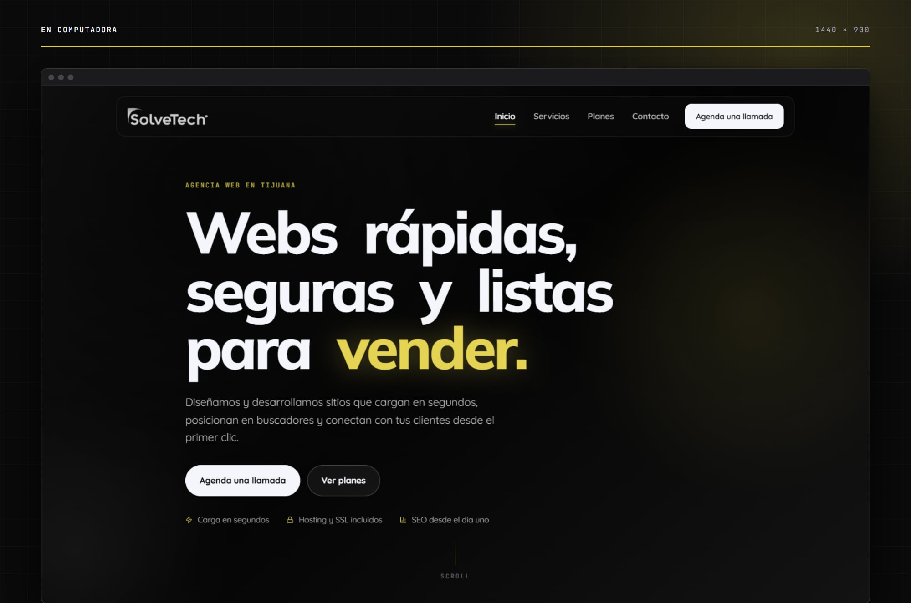
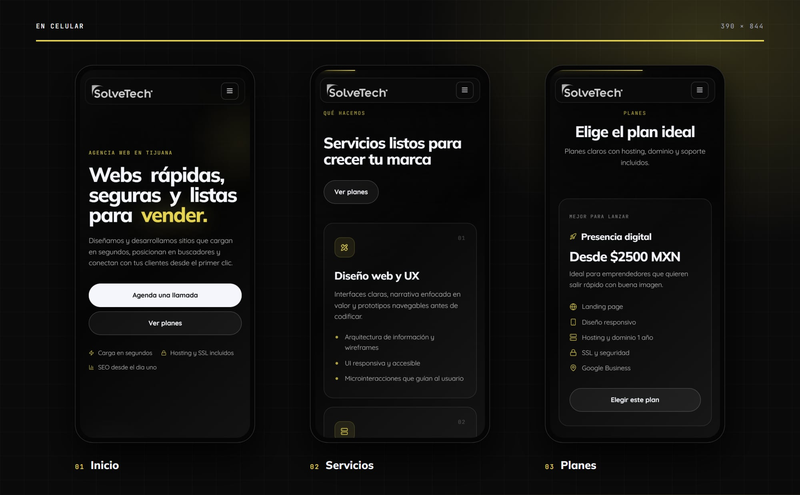

<p align="center">
  
</p>

<h1 align="center">SolveTech</h1>

<p align="center"><b>Agencia de diseño web en Tijuana</b></p>

<p align="center">
  
  
  
  
</p>

## Sobre el proyecto

Sitio de una sola página de **SolveTech**, agencia de diseño web en Tijuana. Presenta los servicios de la agencia, compara sus planes (desde $2,500 MXN, con hosting, dominio, SSL y SEO incluidos) y lleva al contacto por WhatsApp.

Es un sitio estático, hecho con HTML, CSS y JavaScript, sin frameworks ni proceso de build.

## Secciones

| Sección | Contenido |
| --- | --- |
| **Inicio** | Propuesta y llamadas a la acción |
| **Servicios** | Qué incluye cada sitio |
| **Planes** | Comparativa de planes y precios |
| **Contacto** | Agenda por WhatsApp |

## En computadora

<p align="center">
  
</p>

## En celular

<p align="center">
  
</p>

## Tecnologías

- HTML5, CSS3 y JavaScript.
- Diseño adaptable a celular, tableta y computadora.
- Tipografías de Google Fonts: Quicksand, Mulish y JetBrains Mono.
- SEO técnico: `robots.txt`, `sitemap.xml` y datos estructurados.
- Publicado en dominio propio: solvetech.mx.

## Estructura

```
SolveTech/
├── docs/                   # Imágenes de este README
├── Imagenes/
├── index.html              # Página principal
├── LogoLetrasTransparenteClaro.png
├── LogoTransparentecClaro.ico
├── robots.txt              # Reglas para buscadores
├── sitemap.xml             # Mapa del sitio
├── SolveTech-master/
└── styles.css              # Estilos
```

## Créditos

Desarrollado por Salereee. Logotipos, fotografías y textos del negocio pertenecen a SolveTech.
