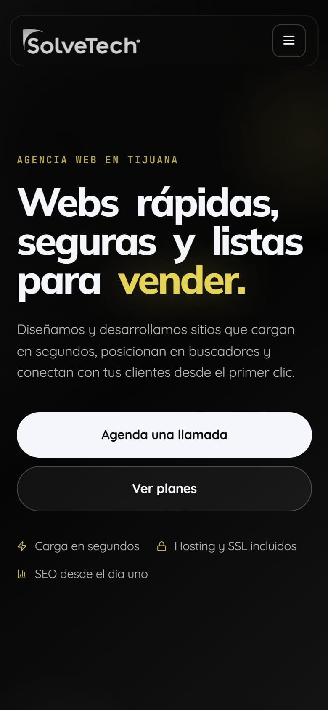

<p align="center">
  
</p>

<h1 align="center">SolveTech</h1>

<p align="center"><b>Agencia de diseño web en Tijuana</b></p>

<p align="center">
  <a href="https://solvetech.mx/"><b>Ver el sitio →</b></a><br><br>
  
  
  
  
</p>

## Sobre el proyecto

Sitio de una sola página de **SolveTech**, agencia de diseño web en Tijuana: presenta sus servicios, compara planes y lleva al contacto por WhatsApp.

Es un sitio estático: HTML, CSS y JavaScript sin frameworks ni proceso de build.

## Secciones

| Sección | Contenido |
| --- | --- |
| **Inicio** | Propuesta y llamadas a la acción |
| **Servicios** | Qué incluye cada sitio |
| **Planes** | Comparativa de planes y precios |
| **Contacto** | Agenda por WhatsApp |

## Capturas

<p align="center">
  
  &nbsp;
  
</p>

## Tecnologías

- HTML5, CSS3 y JavaScript, sin frameworks ni proceso de build.
- Tipografía de Google Fonts (Quicksand, Mulish y JetBrains Mono).
- Diseño adaptable a celular, tableta y computadora.
- Dominio propio: **solvetech.mx**.

## Estructura

```
SolveTech/
├── docs/                       # Imágenes de este README
├── Imagenes/
├── index.html                  # Página principal
├── LogoLetrasTransparenteClaro.png
├── LogoTransparentecClaro.ico
├── robots.txt                  # Reglas para buscadores
├── sitemap.xml                 # Mapa del sitio
├── SolveTech-master/
└── styles.css                  # Estilos
```

## Correr en local

No necesita instalar nada. Abre `index.html` en el navegador, o sírvelo desde la carpeta del repo:

```bash
python -m http.server 8000
```

y entra a <http://localhost:8000>.

## Créditos

Desarrollado por [@Salereee](https://github.com/Salereee). Logotipos, fotografías y textos del negocio pertenecen a SolveTech.
